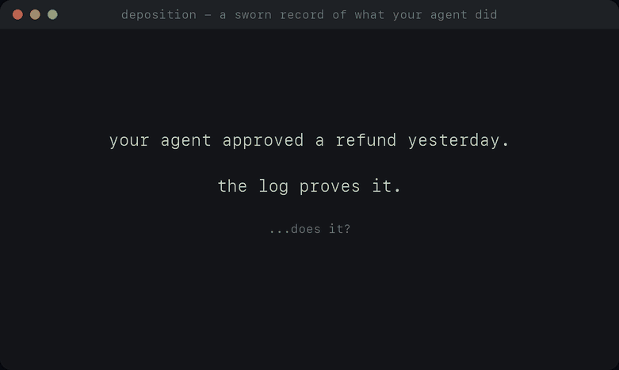

# Deposition

[](https://github.com/chiragrajputuss-code/deposition/actions/workflows/ci.yml)
[](https://pypi.org/project/deposition/)
[](https://pypi.org/project/deposition/)
[](LICENSE)

**A sworn record of what your AI agent actually did.**



*A deposition is sworn testimony, recorded verbatim outside a courtroom and used
as evidence when someone later disputes what happened. That is the idea.*

Deposition records every LLM call, tool call and decision your agent makes into a
tamper-evident, hash-chained trace, then replays that run step by step so you can
see exactly what happened and why.

It is not a metrics dashboard. LangSmith, Langfuse and AgentOps already own that
ground. Deposition's wedge is **replay + tamper-evidence + root cause**: a record
that cannot be altered behind your back, and a causal chain that answers *why did
the agent do that?*

None of the pieces here are inventions. Hash chains, signatures and provenance
tracking are old ideas with living neighbours, and the
[architecture decisions](docs/decisions/) cite them. What this project commits to
is a posture: never in your agent's hot path, never a probabilistic judgment
sealed as fact, never one green light where four separate claims belong — and
independent of every party it records.

```python
import deposition

deposition.init(project="support-triage")

@deposition.record(name="triage-agent")
def run_agent(ticket):
    # OpenAI and Anthropic calls are recorded automatically - request, response,
    # token usage and latency - with no logging code in your agent.
    response = client.messages.create(model="claude-sonnet-5", messages=[...])

    for block in response.content:
        if block.type == "tool_use":
            # No caused_by needed: Deposition saw the model ask for this tool.
            with deposition.step("tool_call", tool=block.name) as body:
                body["result"] = run_tool(block.name, block.input)
```

```console
$ depo verify ./deposition/run_9f3kQ2.jsonl
OK  42 events verified for run_9f3kQ2

$ depo view ./deposition/run_9f3kQ2.jsonl
serving replay viewer on http://127.0.0.1:7878
```

## Status

Pre-release, building in the open. Everything below is implemented and tested
(283 tests) against real agent frameworks, with an independent ground-truth
harness rather than self-report.

| Piece | State |
| --- | --- |
| Trace schema v1.0 — RFC 8785 canonical JSON | done — [ADR 008](docs/decisions/008-canonical-json.md) |
| Hash chain (build + verify) | done |
| Ed25519 signing | done — `[signing]` extra |
| Mandates + `deposition audit` | done — [ADR 010](docs/decisions/010-mandates.md) |
| Argument provenance (injection forensics) | done — prior art cited, [ADR 011](docs/decisions/011-claims-policy.md) |
| Local `.jsonl` recording, blob externalisation | done |
| CLI (`view` / `verify` / `audit` / `diff` / `keygen`) | done |
| Local replay viewer, four-claim trust panel | done |
| OpenAI / Anthropic auto-instrumentation | done (non-streaming) |
| Tool capture: LangGraph, CrewAI, OpenAI Agents SDK, Pydantic AI, AutoGen | done |
| Streaming capture | not yet — request recorded, response is not |
| Countersigning at ingest | Phase 2 — [ADR 005](docs/decisions/005-signing-and-anchoring.md) |
| Interlocking traces (agent-to-agent) | proposed — [ADR 009](docs/decisions/009-interlocking-traces.md) |

## Install

```console
pip install deposition             # SDK + the `depo` CLI
pip install 'deposition[viewer]'   # adds the local replay viewer
pip install 'deposition[signing]'  # adds Ed25519 signing
```

Or clone and install editable, which is what you want if you plan to read the
code - and reading the code is the point of an evidence tool:

```console
git clone https://github.com/chiragrajputuss-code/deposition.git
cd deposition
pip install -e '.[viewer,signing]'
python examples/04_refund_dispute.py
deposition verify ./deposition/run_*.jsonl --pubkey ./deposition/refunds.pem.pub
```

Python 3.10+. The SDK itself has **zero** required dependencies - heavy deps kill
adoption, and a recorder you cannot install is a recorder that records nothing.
`viewer` adds FastAPI; `signing` adds `cryptography`. Neither is needed to record.

Published as `0.1.0.dev0` while the API settles: pre-release, so `pip install
deposition` gives you it only because no stable release exists yet, and nothing
pins to it by accident.

## How it works

One run is one append-only event log. Each line of the `.jsonl` file is one
event, and each event's hash covers the previous event's hash:

```json
{"v":"1.0","run_id":"run_9f3kQ2","seq":14,"ts":"2026-09-27T08:14:03.412Z",
 "type":"tool_call","body":{...},"prev_hash":"9c41…","hash":"e7f2…"}
```

Edit an event, drop one, or reorder two, and `deposition verify` names the first
event where the trace stopped being trustworthy. Hashing is over [RFC 8785](https://www.rfc-editor.org/rfc/rfc8785)
canonical JSON, so a verifier in any language, including one running in a
browser, computes the same bytes and the same hash. The test suite cross-checks
this against a live Node process, including 400 randomly generated doubles.

**What that proves, precisely.** On its own the chain detects corruption and
alteration by anyone who does not hold the trace file. It does not stop someone
who does: they can edit an event and re-seal the rest into a chain that verifies
perfectly. That is what signing is for.

## Signing

```console
$ depo keygen --out signing.pem
private key  signing.pem  (keep this secret, mode 0600)
public key   signing.pem.pub
             4200424479dac722d3a8667b6696dfd3c6fa524ce17424390200c401d4822137
```

```python
deposition.init("support-triage", signing_key="signing.pem")
```

Each run then writes `run_9f3kQ2.sig` beside its trace: an Ed25519 signature over
the chain's head hash. Re-sealing an edited trace changes that head, and the
forger cannot sign the new one.

```console
$ depo verify run_9f3kQ2.jsonl --pubkey signing.pem.pub
OK  42 events verified for run_9f3kQ2
  OK signature: signature verified against 4200424479da...
```

**Pin the key or the signature proves nothing.** The `.sig` file carries the
public key it was signed with, so anyone who rewrites the trace can sign their
version with a key of their own and replace that field. Without `--pubkey`,
`verify` says *signed by an unverified key* and means it. The key has to reach
the verifier by a route the trace did not travel.

A signature checks out only against the head of the trace it was made for, so it
catches the edit-and-reseal the chain cannot:

```console
$ depo verify run_9f3kQ2.jsonl --pubkey signing.pem.pub
OK  42 events verified for run_9f3kQ2
  !! signature: signature covers head 9ce059683c05... but this trace ends at
     e36ebb6fc31b... - the trace was rewritten after it was signed
```

`verify` exits non-zero on a signature that fails, and `--require-signature`
makes an unsigned or unpinned trace a failure too — the flag to use in CI.

**The honest limits.** A key stored on the same disk as the traces it signs
raises the bar; it does not settle the question. Nor does a signature prove
*when* a run happened: `signed_at` is asserted by the signer. Countersigning at
ingest, where the server holds a key you do not, is the real answer, and it is
Phase 2 — see [ADR 005](docs/decisions/005-signing-and-anchoring.md). Deposition
says *tamper-evident* today, and will not say *tamper-proof* until that ships.

Any event may carry `caused_by: [seq, …]` pointing at the earlier events that
produced it. The SDK fills this in where it can — a tool call caused by the LLM
message that requested it — and the viewer walks it backwards to answer "why did
this happen?".

## Privacy

Your prompts are your data. `deposition.init(redact=...)` runs on every event
body **before** anything is hashed or written to disk:

```python
deposition.init(project="support-triage", redact=strip_pii)
```

In local mode nothing leaves your machine at all.

## Documentation

- [Trace schema](docs/decisions/002-schema-v0.md) and its [v1 canonicalisation](docs/decisions/008-canonical-json.md)
- [Architecture decisions](docs/decisions/)
- [Examples](examples/) — 13 runnable agents, including a disputed refund, a
  regulated credit denial, a prompt-injection incident, a multi-agent handoff and
  a GDPR erasure. All but one run with no API key and no network.

## License

Apache 2.0 — see [LICENSE](LICENSE).
